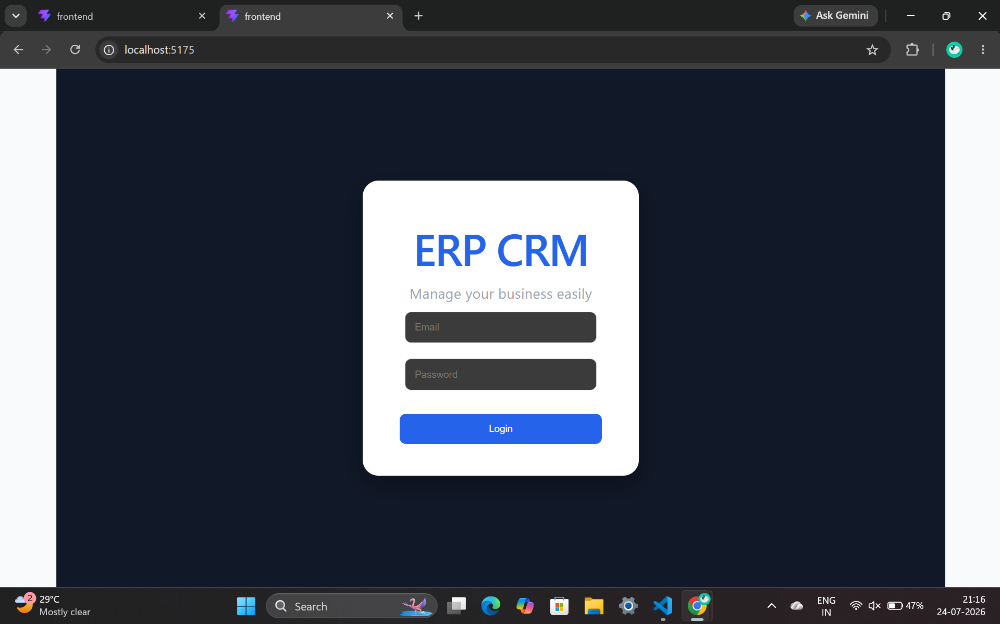
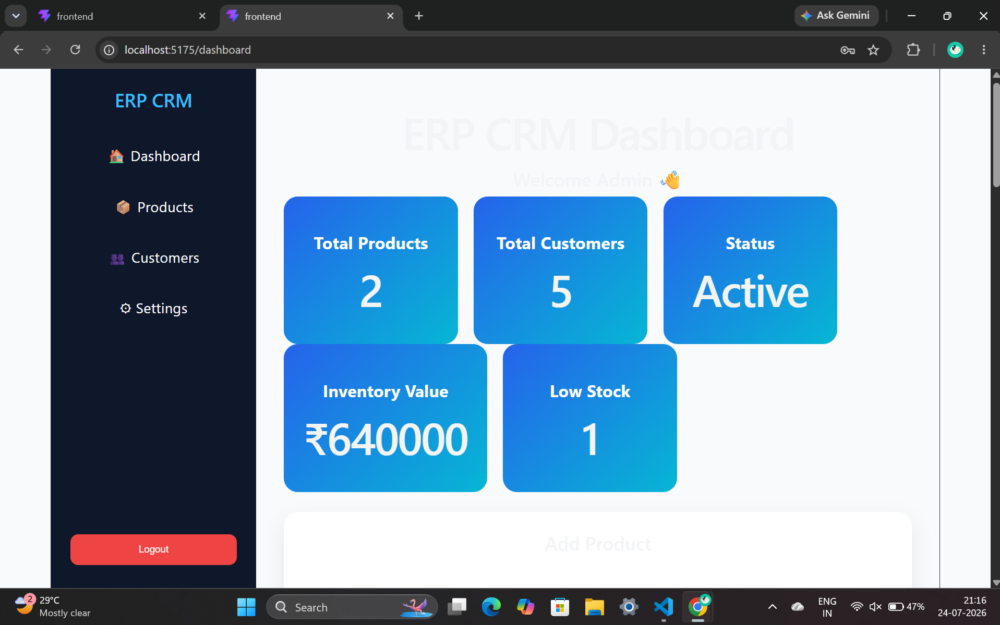
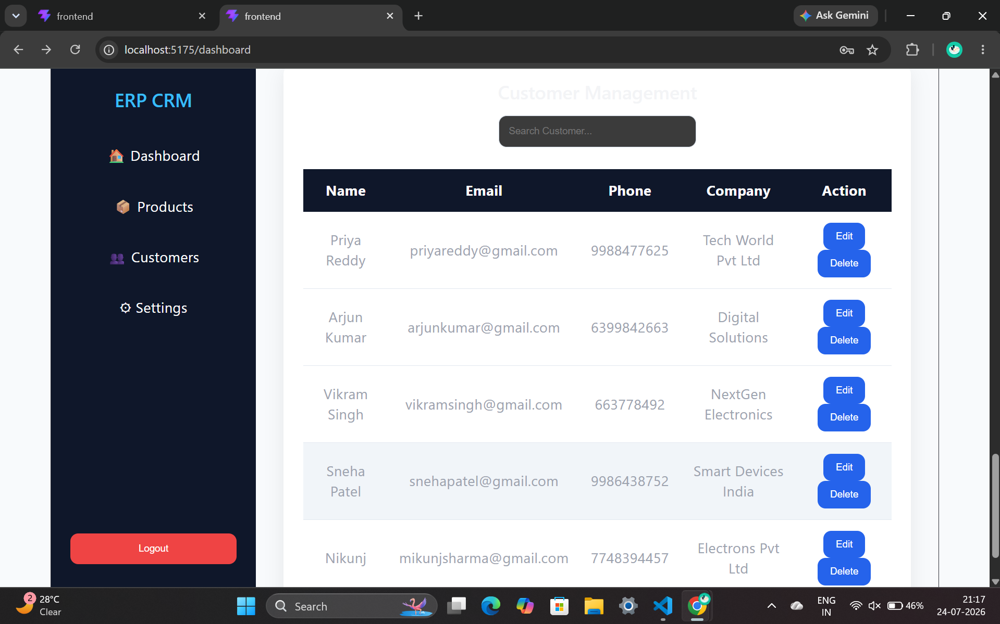

# Mini ERP + CRM Operations Portal

## Project Overview
A full-stack ERP + CRM web application designed to manage products, customers, inventory, and business operations through an admin dashboard.

## Features
- User Login Authentication
- Admin Dashboard
- Product Management
- Customer Management
- Inventory Tracking
- Add, View and Manage Products
- Add and Manage Customers

## Tech Stack

### Frontend
- React.js
- TypeScript
- CSS

### Backend
- Node.js
- Express.js
- REST API

### Database
- PostgreSQL

## Project Structure

ERP-CRM/
|
├── frontend/
|
└── backend/

## How to Run the Project

### Backend
## Screenshots

### Login Page

### Dashboard

### Add Product

### Add Customer

### Customers

### Search Products

